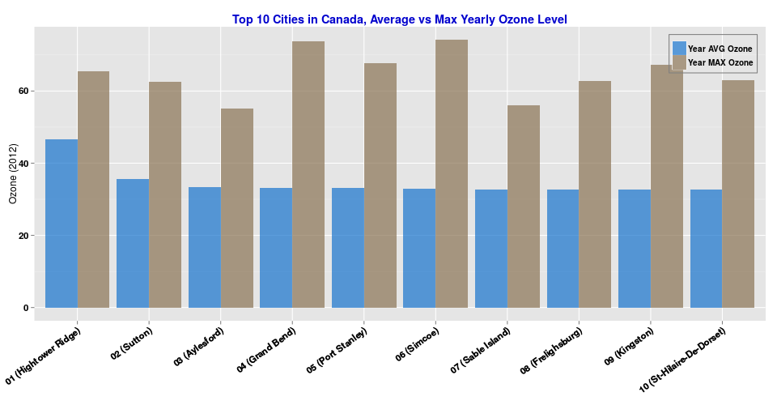
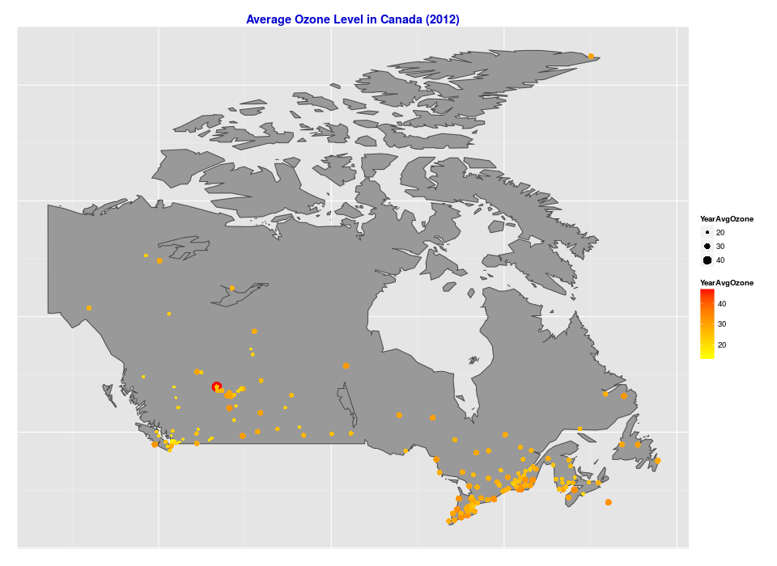

## SOLUTION IN R
The implementation in R is the shortest (code length) and fastest (execution time less than 2 seconds). The code makes use of the fastest packages and was carefully optimized:

- data.table
- magrittr
- readr
- stringi

## EXTRAS
R can do more than data processing & analysis. It can do plot and even geocoding + mapping:
  

 
 
 
